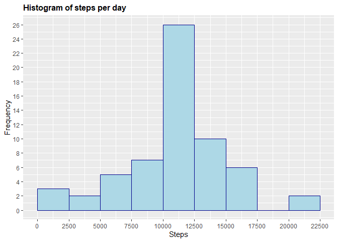

## Loading and preprocessing the data


```r
activity <- read.csv("activity.csv")
library(ggplot2)
library(dplyr)
```

```
## 
## Attaching package: 'dplyr'
```

```
## The following objects are masked from 'package:stats':
## 
##     filter, lag
```

```
## The following objects are masked from 'package:base':
## 
##     intersect, setdiff, setequal, union
```

## What is mean total number of steps taken per day?

### Number of steps per day

```r
SPD <- aggregate(activity$steps, list(activity$date), FUN=sum)
colnames(SPD) <- c("Date", "Steps")
SPD
```

```
##          Date Steps
## 1  2012-10-01    NA
## 2  2012-10-02   126
## 3  2012-10-03 11352
## 4  2012-10-04 12116
## 5  2012-10-05 13294
## 6  2012-10-06 15420
## 7  2012-10-07 11015
## 8  2012-10-08    NA
## 9  2012-10-09 12811
## 10 2012-10-10  9900
## 11 2012-10-11 10304
## 12 2012-10-12 17382
## 13 2012-10-13 12426
## 14 2012-10-14 15098
## 15 2012-10-15 10139
## 16 2012-10-16 15084
## 17 2012-10-17 13452
## 18 2012-10-18 10056
## 19 2012-10-19 11829
## 20 2012-10-20 10395
## 21 2012-10-21  8821
## 22 2012-10-22 13460
## 23 2012-10-23  8918
## 24 2012-10-24  8355
## 25 2012-10-25  2492
## 26 2012-10-26  6778
## 27 2012-10-27 10119
## 28 2012-10-28 11458
## 29 2012-10-29  5018
## 30 2012-10-30  9819
## 31 2012-10-31 15414
## 32 2012-11-01    NA
## 33 2012-11-02 10600
## 34 2012-11-03 10571
## 35 2012-11-04    NA
## 36 2012-11-05 10439
## 37 2012-11-06  8334
## 38 2012-11-07 12883
## 39 2012-11-08  3219
## 40 2012-11-09    NA
## 41 2012-11-10    NA
## 42 2012-11-11 12608
## 43 2012-11-12 10765
## 44 2012-11-13  7336
## 45 2012-11-14    NA
## 46 2012-11-15    41
## 47 2012-11-16  5441
## 48 2012-11-17 14339
## 49 2012-11-18 15110
## 50 2012-11-19  8841
## 51 2012-11-20  4472
## 52 2012-11-21 12787
## 53 2012-11-22 20427
## 54 2012-11-23 21194
## 55 2012-11-24 14478
## 56 2012-11-25 11834
## 57 2012-11-26 11162
## 58 2012-11-27 13646
## 59 2012-11-28 10183
## 60 2012-11-29  7047
## 61 2012-11-30    NA
```

### Histogram of total number of steps taken each day

```r
g <- ggplot(SPD, aes(Steps))
g+geom_histogram(boundary=0, binwidth=2500, col="darkred", fill="red")+ggtitle("Histogram of steps per day")+xlab("Steps")+ylab("Frequency")+theme(plot.title = element_text(face="bold", size=12))+scale_x_continuous(breaks=seq(0,25000,2500))+scale_y_continuous(breaks=seq(0,18,2))
```

```
## Warning: Removed 8 rows containing non-finite values (stat_bin).
```

<!-- -->

### Mean and median of total number of steps taken per day

```r
mean(SPD$Steps, na.rm=TRUE)
```

```
## [1] 10766.19
```


```r
median(SPD$Steps, na.rm=TRUE)
```

```
## [1] 10765
```

## What is the average daily activity pattern?

### Time series plot of the 5 minute interval (x) and averaged number of steps taken averaged across all days (y)

```r
SPT <- aggregate(steps~interval,data=activity,FUN=mean,na.action=na.omit)
SPT$time <- SPT$interval/100
h <- ggplot(SPT, aes(time, steps))
h+geom_line(col="brown")+ggtitle("Average steps per time interval")+xlab("Time")+ylab("Steps")+theme(plot.title = element_text(face="bold", size=12))
```

<!-- -->

###  5-minute interval (on average across all the days) with the maximum number of steps

```r
ST <- tibble::as_tibble(SPT)
ST %>% select(time, steps) %>% filter(steps==max(ST$steps))
```

```
## # A tibble: 1 x 2
##    time steps
##   <dbl> <dbl>
## 1  8.35  206.
```

## Imputing missing values

### Total number of missing values in the dataset

```r
ACT <- tibble::as_tibble(activity)
ACT %>% filter(is.na(steps)) %>% summarize(missing_values = n())
```

```
## # A tibble: 1 x 1
##   missing_values
##            <int>
## 1           2304
```

### Replace missing values

```r
activity$CompleteSteps <- ifelse(is.na(activity$steps), round(SPT$steps[match(activity$interval, SPT$interval)],0), activity$steps)
```

### New dataset that is equal to the original dataset but with the missing data filled in

```r
activityFull <- data.frame(steps=activity$CompleteSteps, interval=activity$interval, date=activity$date)
head(activityFull, n=10)
```

```
##    steps interval       date
## 1      2        0 2012-10-01
## 2      0        5 2012-10-01
## 3      0       10 2012-10-01
## 4      0       15 2012-10-01
## 5      0       20 2012-10-01
## 6      2       25 2012-10-01
## 7      1       30 2012-10-01
## 8      1       35 2012-10-01
## 9      0       40 2012-10-01
## 10     1       45 2012-10-01
```

### Histogram of the total number of steps taken each day with missing data filled in

```r
SPDFull <- aggregate(activityFull$steps, list(activityFull$date), FUN=sum)
colnames(SPDFull) <- c("Date", "Steps")

g <- ggplot(SPDFull, aes(Steps))
g+geom_histogram(boundary=0, binwidth=2500, col="darkblue", fill="lightblue")+ggtitle("Histogram of steps per day")+xlab("Steps")+ylab("Frequency")+theme(plot.title = element_text(face="bold", size=12))+scale_x_continuous(breaks=seq(0,25000,2500))+scale_y_continuous(breaks=seq(0,26,2))
```

<!-- -->

### Calculate and report the mean and median total number of steps taken per day. 

```r
mean(SPDFull$Steps)
```

```
## [1] 10765.64
```

```r
median(SPDFull$Steps)
```

```
## [1] 10762
```
* Do these values differ from the estimates from the first part of the assignment? What is the impact of imputing missing data on the estimates of the total daily number of steps?

Imputing missing data have only a little impact on the mean ant the median of the total daily number of steps. Watching the histogram we can note than the only thing changing is the interval between 10000 and 12500 steps, grown from a frequency of 18 to a frequency of 26.

## Are there differences in activity patterns between weekdays and weekends?

### Create a new factor variable in the dataset with two levels - “weekday” and “weekend” indicating whether a given date is a weekday or weekend day

```r
activityFull$RealDate <- as.Date(activityFull$date, format = "%Y-%m-%d")
activityFull$weekday <- weekdays(activityFull$RealDate)
activityFull$DayType <- ifelse(activityFull$weekday=='sábado' | activityFull$weekday=='domingo', 'weekend','weekday')
head(activityFull, n=10)
```

```
##    steps interval       date   RealDate weekday DayType
## 1      2        0 2012-10-01 2012-10-01   lunes weekday
## 2      0        5 2012-10-01 2012-10-01   lunes weekday
## 3      0       10 2012-10-01 2012-10-01   lunes weekday
## 4      0       15 2012-10-01 2012-10-01   lunes weekday
## 5      0       20 2012-10-01 2012-10-01   lunes weekday
## 6      2       25 2012-10-01 2012-10-01   lunes weekday
## 7      1       30 2012-10-01 2012-10-01   lunes weekday
## 8      1       35 2012-10-01 2012-10-01   lunes weekday
## 9      0       40 2012-10-01 2012-10-01   lunes weekday
## 10     1       45 2012-10-01 2012-10-01   lunes weekday
```

### Two time series plot of the 5-minute interval (x) and the average number of steps taken averaged across weekday days or weekend days (y)

```r
StepsPerTimeDT <- aggregate(steps~interval+DayType,data=activityFull,FUN=mean,na.action=na.omit)
StepsPerTimeDT$time <- SPT$interval/100
j <- ggplot(StepsPerTimeDT, aes(time, steps))
j+geom_line(col="darkblue")+ggtitle("Average steps per time interval: weekdays versus weekends")+xlab("Time")+ylab("Steps")+theme(plot.title = element_text(face="bold", size=12))+facet_grid(DayType ~ .)
```

<!-- -->

